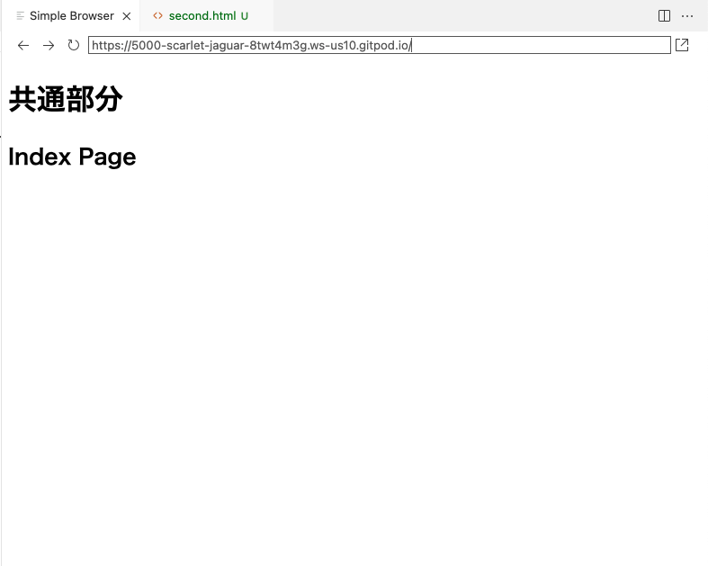
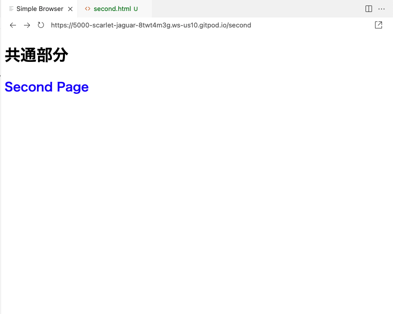

# Flask Hands On

このドキュメントは、PythonのWebアプリケーションフレームワークである[Flask](https://flask.palletsprojects.com/en/2.0.x/)のハンズオンです。

## 目次
* 環境構築
* 最小のFlaskアプリケーションを作ってみる
* templateを使ってHTMLを表示してみる
* templateの共通部分をまとめてみる
* 参考リンク

## 環境構築

このセクションではFlaskの開発環境の構築方法を解説します。  
ここでは、環境構築方法として以下の二通りを紹介します。

* GitPod(オンラインエディタ)を利用した方法・・・もっとも簡単
* ローカルで構築・・・もっとも一般的

### GitPod(オンラインエディタ)を利用した方法[**GitHubのアカウントが必要**]

> GitPodとはブラウザ上でプログラミング環境を利用できるオンラインエディタです。

GitPodでの開発環境を用意しておきました！  

flask_hands_on: [https://gitpod.io#github.com/RYoTA1209/flask_hands_on](https://gitpod.io#github.com/RYoTA1209/flask_hands_on)


```
ページを開いたらGitHubのログインが求められるので自分のGitHubのアカウントでログインしてください。
```

### ローカルで構築

公開している`flask_hands_on`のレポジトリをクローンしてローカルで構築することができます。

```bash
$ git clone https://github.com/RYoTA1209/flask_hands_on # レポジトリのクローン
$ python -m venv venv   # 仮想環境の作成
$ . venv/bin/activate   # 仮想環境を有効化
$ pip install -r requirements.txt   # パッケージのインストール
```

## 最小のFlaskアプリケーションを作ってみる

`flask_hands_on`はすでに最小のFlaskアプリケーションになっています。

```python
@app.route('/')
def hello_world():
    return '<h1>Hello, World</h1>'
```
このコードは、`http://localhost:5000/`にアクセスしたときに`<h1>Hello, World</h1>`という文字列を表示するという意味です。試しに`<h1>Hello, World</h1>`の部分を変えてみると表示が変わることがわかると思います。

## templateを使ってHTMLを表示してみる

上のセクションでは、直接文字列を返していましたがより複雑なHTMLになってくると、すべてを書いていくのはコードが見づらくなるしミスの原因に繋がります。そこでFlaskの`テンプレート`と呼ばれる機能を利用し、表示するHTMLを返すことが出来ます。

### 手順

1. `templates`と言う名前でフォルダを作る
2. `templates`フォルダ内に`index.html`を作成する
3. `index.html`にHTMLを書いていく

    `index.html`
    ```html:index.html
    <!DOCTYPE html>
    <html lang="ja">
    <head>
        <meta charset="UTF-8">
        <title>Document</title>
    </head>
    <body>
        <h1>Index Page</h1>
    </body>
    </html>
    ```
4. `app.py`で`index.html`を返すようにコードを書く

    `app.py`
    ```python
    from flask import Flask, render_template    # render_templateをimportするのを忘れないように！

    app = Flask(__name__)

    @app.route('/')
    def hello_world():
        return render_template('index.html')    # render_template関数で返すHTMLを指定する
    ```
5. プレビューをリロードすると画面上の表示が変わっているはず

## templateの共通部分をまとめてみる
Flaskにはテンプレートの継承するための機能があり、これを使うと`どのページも同じレイアウト`で作成することが出来ます。

### イメージ

どちらのページも『共通部分』という文字のレイアウトは変わっていない

1ページ目(/)



2ページ目(/second)

> ２ページめだけ`<h1>`タグだけ青色にするCSSを読み込んでいる




継承を使うには、レイアウトを指定する`base.html`に`block`を定義していく。
各ページのhtmlにはそのブロックに要素を追加していきます。

`templates/base.html`
```html
<!DOCTYPE html>
<html lang="ja">
<head>
    <meta charset="UTF-8">
    <title>Document</title>
    
    
</head>
<body>
    <h1>共通部分</h1>
    
    
</body>
</html>
```

`templates/index.html`

> ``で`base.htmlを継承する`という意味

> `index.html`の`bodyブロック`に書かれた内容が`base.html`の`bodyブロック`のところに埋め込まれる
```html



<h2>Index Page</h2>

```

`templates/second.html`

> ``で`base.htmlを継承する`という意味

> `second.html`の`headブロックとbodyブロック`に書かれた内容が`base.html`の`headブロックとbodyブロック`のところに埋め込まれる
```html



<style>
    h2 {
        color: blue;
    }
</style>



<h2>Second Page</h2>

```


`app.py`

> `/`にアクセスされたら`index.html`,`/second`にアクセスされたら`second.html`を返すようにする

```python
from flask import Flask, render_template

app = Flask(__name__)

@app.route('/')
def hello_world():
    return render_template('index.html')    # '/'にアクセスされたらindex.htmlを返す

@app.route('/second')
def second():
    return render_template('second.html')  # '/second'にアクセスされたらsecond.htmlを返す
```

## 参考リンク

- [Flask 公式サイト(英語)](https://flask.palletsprojects.com/)
- [【保存版】30分でFlask入門！Webアプリの作り方をPythonエンジニアが解説](https://tech-diary.net/flask-introduction/)
- [【Flask】テンプレートの継承とレイアウトファイル](https://ymgsapo.com/2019/09/19/template-extends-flask/)